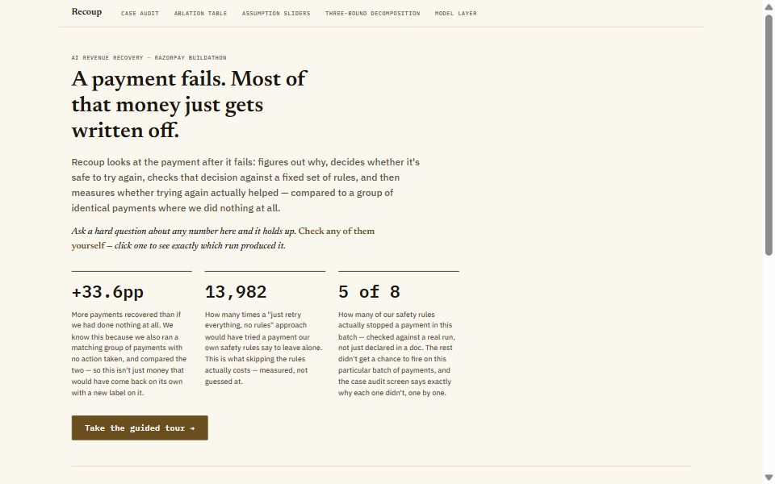
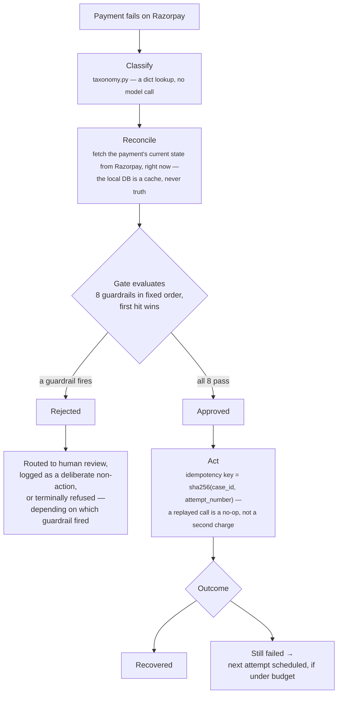
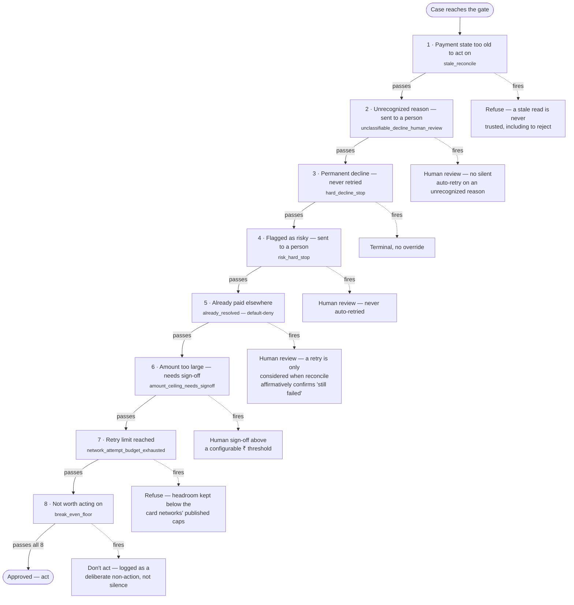
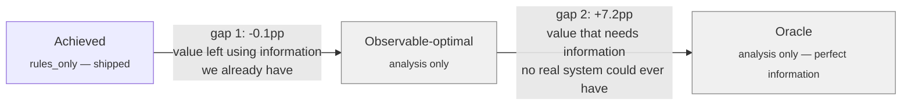

<!-- Title block -->
# Recoup

Works a failed Razorpay payment after it dies — classifies it, decides whether a retry is safe, checks that against a fixed set of rules, acts only if permitted, and measures the effect against a control group.

[](https://github.com/VahantSharma/Recoup/actions/workflows/ci.yml)


## The claim

Most of a failed payment's value just gets written off. Recoup works the case after the attempt died: classifies why, decides whether a retry is safe, checks that decision against a fixed set of rules, and measures whether acting actually helped — against a matched group where nothing was done. Every number on this page survives a follow-up question, and [`VERIFY.md`](VERIFY.md) tells you the exact command to check each one yourself.

## See it



## Quickstart

```bash
cd backend && pip install -r requirements.txt && python -m scripts.init_db
cd backend && uvicorn app.main:app --reload      # terminal 1 — the one live endpoint
cd frontend && npm install && npm run dev        # terminal 2 — the screen itself
```

Open the URL `npm run dev` prints (default `http://localhost:5173`). Or run `./run.sh` to do all of the above in one command and print the URL for you. Full setup (keys, troubleshooting): [`SETUP.md`](SETUP.md).

**New here?** [`REVIEWING.md`](REVIEWING.md) has a 2/10/30-minute reading path.
[`architecture.md`](architecture.md) has components, boundaries, and data flow
(currently a stub pointing at where that content actually lives today — see the file
itself).

## Where every number comes from

| Tier | What it means |
|---|---|
| **Verified live** | Watched happen for real, this session — a real failed payment on the Case Audit screen; an AI model that actually answered when called. |
| **Documented** | Razorpay's own published word, not something we observed live ourselves — e.g. the 17 real reasons a card payment can fail, from their docs. |
| **Our own work** | Built on top of the above, ours to defend — which failures are worth retrying, and every safety rule the system follows. |
| **Assumed** | Nobody publishes this number. An honest, clearly-labeled guess, swept across a wide range and checked for whether the conclusion survives it — never a hidden point estimate. |

<details>
<summary><strong>The fuller, per-number-category version of this table</strong> — what backs the Day 3/4 results specifically</summary>

| Kind | What's in that bucket | Example |
|---|---|---|
| Verified live | Fetched from the real API this session, not assumed | `gemini-3.5-flash-lite` model id (the originally-planned `gemini-2.5-flash-lite` 404'd — caught by calling the real API, not a doc) |
| Razorpay-published | Their vocabulary, not their classification | The 17 documented card-error reason strings, from `errors/payments/list` |
| Recoup's own work | Built on top of the above, ours to defend | The hard/soft/technical taxonomy; the yield-at-scarcity mechanism |
| Assumption | Sourced range or explicit "NO PUBLIC SOURCE FOUND," logged in `docs/assumptions.md` | `card_reuse_factor`, `organic_recovery_rate_bps` |
| Ablation result | A real run, traced to a git SHA + manifest | The 8-arm held-out table |
| Sensitivity sweep | Does the ranking hold across the whole plausible parameter space | Day 3's OAT/joint sweep, re-checked under CRN on Day 4 |
| **Null-arm test** | **A structural proof, not a statistical one** — two policies with byte-identical logic must produce byte-identical outcomes under a correctly-paired design | `tests/test_null_arm_lift_is_zero.py`: exact zero under the fix, a measured non-zero noise floor under the found-and-fixed bug |
| **Three bound types** | **Achieved / observable-optimal / oracle are three different claims, never collapsed into one number** | See the diagram below |

One line on provider terms, since the evidence chain above depends on it: Gemini's free tier trains on submitted content by default (paid tier doesn't); Groq's agreement excludes training on submitted content regardless of tier. A non-issue here — the corpus is synthetic/resampled and synthesis input is aggregate statistics from our own run, never real customer data — and the provider-agnostic interface means a production deployment swaps to Gemini's paid tier or to Groq without a code change.
</details>

## System architecture

Corpus → classification (rules) → the durable state machine → the policy gate (still rules, still outside the model) → the harness that measures it, against a simulator the policy code is structurally forbidden to read → manifest-stamped artifacts → the frontend, which can only read those artifacts, never a hand-typed number. Two of those boundaries are enforced by a real test/lint check, not just a comment saying not to cross them — marked below.

```mermaid
flowchart LR
    CORPUS["Corpus builder<br/><sub>resampled + 1 harvested</sub>"]
    TAX["Taxonomy<br/><sub>rules — no model call</sub>"]
    SM["State machine<br/><sub>durable, idempotent</sub>"]
    GATE["Policy gate<br/><sub>8 guardrails, outside the model</sub>"]
    MODEL["Model layer<br/><sub>playbook synthesis only</sub>"]
    SIM["Simulator<br/><sub>ground truth</sub>"]
    HARNESS["Harness<br/><sub>8-arm ablation, common random numbers</sub>"]
    ART["Artifacts<br/><sub>manifest-stamped JSON</sub>"]
    FE["Frontend<br/><sub>React + Vite</sub>"]

    CORPUS --> TAX --> SM --> GATE
    MODEL -.->|"rationale text only,<br/>never the decision"| GATE
    GATE --> HARNESS
    SIM -.->|"ground truth"| HARNESS
    GATE -.->|"never imports —<br/>enforced by tests/test_import_boundary.py<br/>(AST-walks every file under app/)"| SIM
    HARNESS --> ART
    ART -.->|"only src/lib/artifacts/ may read *.json —<br/>enforced by npm run check:imports"| FE

    style GATE fill:#f5e6c8,stroke:#6b4e1e
    style SIM fill:#f0f0f0,stroke:#888
```



## One case, end to end



## The eight guardrails

Checked in exactly this order, short-circuiting on the first hit — proven exhaustively
against the real code (all 27 pairwise combinations, not spot-checked):
`tests/test_gate.py::test_guardrail_order_constant_matches_every_pairwise_short_circuit`.



## Results

| Number | Status | What it means |
|---|---|---|
| **+33.6pp** (95% CI: +31.0 to +36.4) | Day 3 — current | How many more payments the rules-only policy recovers than doing nothing, on the identical batch, against a real control group. |
| **13,982** | Day 3 — current | How many times a "just retry everything" policy would have acted against this project's own safety rules, on that same batch — what skipping the rules costs, measured. |
| **5 of 8** | Day 3 — current | Real policy guardrails that actually fired at least once in this batch, checked against a live run. |
| **Both providers abstained** (Gemini, Groq) | Day 4 — **pending verification** | Under a rule committed *before* the bake-off ran — a real pre-registration, not a rule fitted to the results. The model layer currently contributes nothing to the shipped policy, on purpose. |
| **-0.1pp** achieved → observable-optimal | Day 4 — **pending verification** | `rules_only` is already close to the ceiling of what a policy using only real-system information could do — essentially no value is left on the table using information we already have. |
| **+7.2pp** observable-optimal → oracle | Day 4 — **pending verification** | The honest ceiling: how much a perfect, impossible-to-have crystal ball would still add on top. No real system can reach it; it exists to show where the real headroom is (see "known limitations" below). |

**"Pending verification" means exactly this, not a vague hedge**: a Day 3 fix (the
state-machine transition-order correction) shifted the corpus's random-number stream.
Day 3's own numbers above were regenerated against that fix and are current. Day 4's
weren't yet — regenerating them means re-running multi-minute 10-seed × 8-arm sweeps
and, for the bake-off, real (free-tier) API calls, which is real, separately-scoped
work `docs/audit.md` explicitly didn't rush under its own timebox. `VERIFY.md §7` has
the exact command to regenerate them yourself.

## The three bounds

*Achieved* is what a submittable policy actually does. *Observable-optimal* is analysis-only — the best any policy could do using only information a real system actually has. *Oracle* is also analysis-only — the ceiling under perfect information no real system could ever have. Collapsing these into one "headroom" number is exactly the kind of unfalsifiable claim this project exists to refuse.



Both gap values are Day 4 numbers — see the pending-verification note above.

## How to check any of this

[`VERIFY.md`](VERIFY.md) has a command and an exact expected output for every claim on
this page. Three examples:

```bash
cd backend

# Reconcile-before-act refuses on an already-resolved payment (VERIFY.md §2)
pytest tests/test_gate.py::test_rejects_an_unrecognized_reconciled_status_default_deny -v

# A replayed action is a no-op, not a second charge (VERIFY.md §3)
pytest tests/test_main_live_endpoint.py::test_replaying_the_same_attempt_number_is_a_no_op_not_a_second_link -v

# Re-run an export script twice, diff the two runs against each other -- zero bytes (VERIFY.md §6)
python -m scripts.export_case_audit && cp ../frontend/public/data/case_audit.json /tmp/run1.json
python -m scripts.export_case_audit && diff /tmp/run1.json ../frontend/public/data/case_audit.json
```

## Known limitations — stated here, not left for you to find

- **Retry timing is a flat 24-hour delay for every decline class and every attempt, not timed against a balance-availability prior.** No published per-class prior exists to key a real schedule on; inventing one would be exactly the kind of unsourced number this project refuses everywhere else. The "+7.2pp" oracle gap above is the measured signal for where a chunk of that missed value most plausibly lives — full reasoning in [`docs/ENGINEERING-DOCTRINE.md`](docs/ENGINEERING-DOCTRINE.md)'s decline-taxonomy section.
- **Merchant advice-code stop (Mastercard 03/21) is not implemented.** It's the correct real-world do-not-retry signal, but Razorpay exposes no advice-code field on any payment this project has access to — building the check would mean inventing the exact data it inspects, which is the same circularity this project refuses everywhere else. Named as the first thing a v2 needs a real acquirer feed for.
- **Razorpay's Payment Links endpoint has no idempotency key of its own.** This project's idempotency key stops a replayed *request* from double-acting, but if the external call itself had already succeeded moments before a crash, and only the local record of that success was lost, resuming can still create a second real Payment Link. Named in `app/state_machine.py::derive_idempotency_key`'s own docstring — see `VERIFY.md §4`.
- **Both model-layer arms abstained**, under a pre-registered rule — the model layer currently contributes nothing to the shipped policy. `VERIFY.md §7` has the commands to confirm this yourself.
- **Every Day 4 number above is currently flagged "pending verification."** Stated inline in the results table, not down here as an afterthought.

## What I found in my own work

[`docs/audit.md`](docs/audit.md) is an adversarial self-audit of this project, by this
project — every claim in the doctrine file checked against the code that's supposed to
back it, hostile inputs fired at the money path and the artifact layer, a real
concurrent-race test against the database, and a cost check. It found six real
problems, including two guardrails the doctrine claimed but the code never implemented,
and a headline results table that didn't reproduce from its own committed pipeline —
that specific correction (the state-machine transition order, and what it broke) is
detailed in [`docs/results.md`](docs/results.md)'s Correction section. Fixed what was
fixable, corrected what wasn't buildable honestly instead of faking it, and published
the difference — old numbers next to new, not overwritten.

## Repo map

| Path | What's in it |
|---|---|
| `backend/` | FastAPI app — corpus builder, taxonomy, state machine, policy gate, harness, simulator, model layer, the one live endpoint, tests |
| `frontend/` | React + Vite reviewer surface — landing page, guided tour, case audit, ablation table, model layer panel |
| `docs/` | The plan, results (with corrections), assumptions register, the self-audit, the engineering doctrine, screenshots — see [`docs/README.md`](docs/README.md) for the full map |
| `interview/` | Personal interview-prep material — not part of the submission surface, disclosed where it lags the corrections in `docs/` |
| `data/` | Local SQLite DB (gitignored) + the real harvested-corpus JSON (tracked) |
| `.github/workflows/` | The CI workflow this README's badge points at |

## What I'd build next

1. **A real balance-availability-timed retry schedule.** The single highest-value gap named above — the "+7.2pp" oracle number is the measured signal for it, not a guess that it matters.
2. **A real merchant-advice-code feed.** Needs an acquirer relationship this project doesn't have; the check itself is already scoped, just waiting on real data to not have to invent.
3. **Close the Payment Links idempotency window properly** — likely means a pre-commit "intent" row with its own reconciliation pass against Razorpay's actual payment-link list, rather than trusting the local record alone.
4. **Regenerate Day 4 properly** and drop the "pending verification" flag for good, rather than re-run once more under time pressure.

## License

MIT — see [`LICENSE`](LICENSE).
