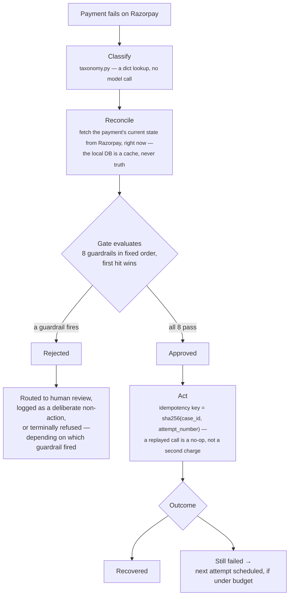
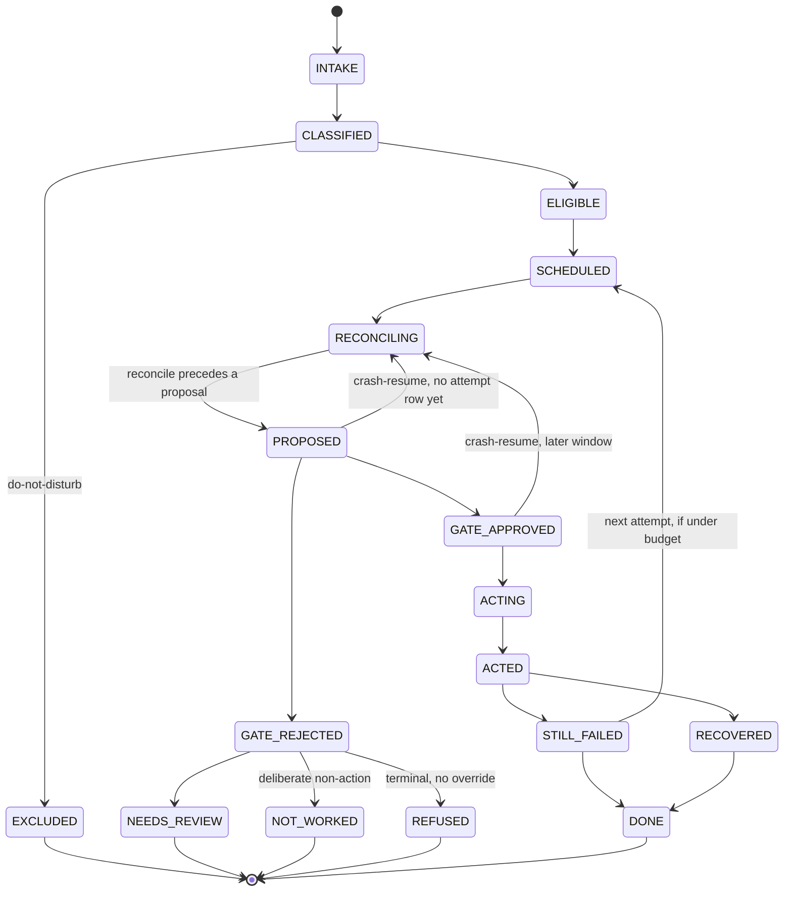
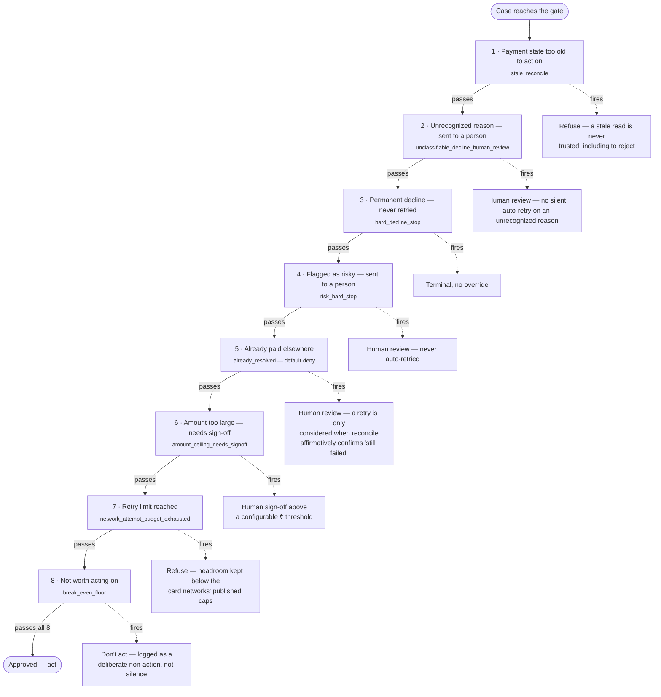
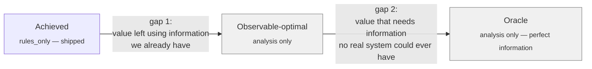

<!-- Title block -->
# Architecture

## The problem, and what Recoup does

A payment fails. Some of that money comes back on its own; most of it just gets
written off. Recoup works the case *after* the attempt died: it classifies why the
payment failed, decides whether a retry is safe, checks that decision against a fixed
set of rules that live outside any model, acts only when permitted, and measures
whether acting actually helped — against a matched control group that got no action at
all, on the identical batch of payments. The headline metric is always incremental
lift over doing nothing, never gross recovery.

This document describes what the system actually is: its components and the
boundaries between them, how one case moves through it, every safety mechanism that
stops it from double-charging or auto-retrying something it shouldn't, how the measured
results are designed to survive a follow-up question, and where a model is and isn't
part of the decision. For the day-by-day account of how it got built this way, see
[`docs/buildathon-plan.md`](docs/buildathon-plan.md) and
[`docs/results.md`](docs/results.md). For a command that checks any specific claim
below yourself, see [`VERIFY.md`](VERIFY.md).

## Where every fact in this document comes from

| Tier | What it means |
|---|---|
| **Verified live** | Watched happen for real — a real failed payment run through the real Case Audit screen; an AI model that actually answered when called. |
| **Documented** | Razorpay's own published word, not something observed live — e.g. the 17 real reasons a card payment can fail, from their docs. |
| **Our own work** | Built on top of the above, ours to defend — which failures are worth retrying, and every safety rule the system follows. |
| **Assumed** | Nobody publishes this number. An honest, clearly-labeled guess, swept across a wide range and checked for whether the conclusion survives it — never a hidden point estimate. |

## Components, and the boundaries between them

Rules where rules work, a model where language lives, statistics where money decisions
live. Two of the boundaries below are enforced structurally — a real test fails if the
boundary is crossed, not just a comment asking a future change not to cross it — and
both were verified to actually catch a violation: a real forbidden import was
temporarily added, the test was confirmed to fail naming the exact offending file, and
the change was reverted.

```mermaid
flowchart LR
    CORPUS["Corpus builder<br/><sub>resampled + 1 harvested</sub>"]
    TAX["Taxonomy<br/><sub>rules — a dict lookup, no model call</sub>"]
    SM["Case store<br/><sub>state machine, durable, idempotent</sub>"]
    GATE["Policy gate<br/><sub>8 guardrails, outside the model</sub>"]
    MODEL["Model layer<br/><sub>playbook synthesis only</sub>"]
    SIM["Simulator<br/><sub>ground truth</sub>"]
    HARNESS["Harness<br/><sub>8-arm ablation, common random numbers</sub>"]
    ART["Export layer<br/><sub>manifest-stamped JSON artifacts</sub>"]
    LIVE["Live endpoint<br/><sub>reconcile + act, real test-mode API</sub>"]
    FE["Frontend<br/><sub>React + Vite, reads artifacts only</sub>"]

    CORPUS --> TAX --> SM --> GATE
    MODEL -.->|"rationale text only,<br/>never the decision"| GATE
    GATE --> HARNESS
    GATE --> LIVE
    SIM -.->|"ground truth"| HARNESS
    GATE -.->|"never imports —<br/>tests/test_import_boundary.py,<br/>an AST walk of every file under app/"| SIM
    HARNESS --> ART
    ART -.->|"only src/lib/artifacts/ may read *.json —<br/>enforced by npm run check:imports"| FE
    LIVE -.->|"reconcile-before-act, every call"| RZP(["Razorpay test-mode API"])

    style GATE fill:#f5e6c8,stroke:#6b4e1e
    style SIM fill:#f0f0f0,stroke:#888
```

**The case store** (`app/models.py`, `app/state_machine.py`, `app/db.py`) owns the
durable record of every case, attempt, and batch, and the legal transitions between
case states — the only place a case's state is allowed to change.

**The taxonomy** (`app/taxonomy.py`) owns exactly one decision: given a decline reason
string, is it hard, soft, technical, or unknown. Deterministic, a plain dict lookup, no
model call.

**The corpus builder** (`app/corpus_builder.py`) owns turning Razorpay's documented
reason strings into a full simulated batch of cases, resampled against sourced-or-flagged
parameters (`docs/assumptions.md`), with the one real harvested case concatenated in
untouched.

**Two parameter modules that must never share a value in the wrong direction**
(`app/policy_params.py` and `app/simulator/params.py`) — one owns what the policy gate
*believes* about recovery odds; the other owns what actually *happens*, in the
simulator's ground truth. If one shared parameter fed both, the policy would always be
exactly right about its own odds, by construction — an unfalsifiable measurement. Kept
structurally separate, swept independently.

**The policy gate** (`app/gate.py`) owns exactly one decision: given a proposed action
and a case's current, freshly-reconciled state, is it permitted, blocked, or does it
need a human. Deterministic, eight guardrails, checked in a fixed order — the full list
is below.

**The harness** (`app/harness/`) owns running a policy over a batch of cases through
simulated time and comparing policies against each other under identical conditions:
`clock.py` (an event-driven simulated clock), `policies.py` (control, blind retry,
rules only, the playbook-driven arms), `run.py` (the event loop tying a policy, the
gate, and the simulator together), `stats.py` (paired bootstrap confidence intervals),
`sweep.py` (the sensitivity sweep across many batches), `compliance.py` (the net-value
break-even calculation), and `oracle.py` / `observable_optimal.py` (the two
analysis-only ceiling arms — never submittable, see "Measurement design" below).

**The simulator** (`app/simulator/`) owns ground truth: whether a case is actually
recoverable, whether and when it resolves on its own, and whether a given attempt
succeeds. The policy gate is structurally forbidden from importing it.

**The model layer** (`app/model/`) owns talking to Gemini and Groq, caching and
rate-limiting those calls, the `Playbook` schema a provider has to return, the
deterministic sensibility checks, the pre-registered abstention rule, and the grid
search that produces the `tuned_weights` playbook with zero network calls.

**The export layer** (`app/export.py`, `app/export_schemas.py`) owns turning a real
run's output into a committed JSON artifact the frontend is allowed to read, with a
manifest attached — every field mirrors a value the underlying script already computed,
never a new computation invented for the frontend's sake.

**The live endpoint** (`app/main.py`) owns the one path that talks to Razorpay in real
time, at request time, gated by the same unmodified `gate.evaluate()` every other arm
uses.

**The frontend** (`frontend/src/`) owns rendering committed artifacts, and only
committed artifacts, as screens a reviewer can actually click through.

### The two structurally-enforced boundaries

1. **The policy gate may never import the simulator's ground truth.**
   `tests/test_import_boundary.py` AST-walks every file under `app/` looking for an
   `app.simulator` import outside a short, named exemption list (the harness's own
   event loop and sweep code, and `oracle.py` — whose entire job is reading ground
   truth directly, because it is not a submittable policy, it is a measurement ceiling
   that only makes sense with information no real policy could ever have). A candidate
   policy file (`app/harness/policies.py`) gets no exemption, and a regression test
   proves the exemption list hasn't quietly widened to cover it.
2. **Nothing may render a number the frontend didn't get through a committed,
   manifested artifact.** `src/lib/artifacts/` is the only frontend code allowed to
   read a `.json` file from `public/data/` — enforced by
   `scripts/check-artifact-import-boundary.mjs`, wired into `npm run lint`. On top of
   that, `Figure.tsx` is the only sanctioned way to display a value on any screen: it
   takes a `Provenanced<T>`, not a bare value, and because this is TypeScript, a
   hardcoded literal does not typecheck into that slot.

## One case, end to end

## Safety mechanisms

### The case state machine

Every transition is a real committed row — nothing skips straight from a case becoming
eligible to an action being marked complete. A process that dies mid-action resumes by
re-reading the case's current `state` and its `case_attempts` row, not by re-deriving
intent from scratch.

`RECONCILING` sits **before** `PROPOSED`, not after gate approval — a correction found
while wiring the live endpoint through every real state (`docs/results.md`'s
Correction section has the full account of the bug this fixed: the original table put
reconciling after the gate, which is structurally impossible since `gate.evaluate()`
requires a reconciled result as an input). `NOT_WORKED` (the gate's deliberate
economic non-action, `break_even_floor`) is kept structurally distinct from `REFUSED`
(every other terminal rejection — hard-decline, already-resolved, budget-exhausted,
stale-reconcile) — the same distinction the frontend's "policy" tone versus "stop" tone
enforces on screen.

**The one disclosed gap**: if the external Payment Link call itself had actually
already succeeded on Razorpay's side moments before a crash, and only the local record
of that success was lost, resuming creates a second real Payment Link — Razorpay's
Payment Links endpoint has no client-supplied idempotency key for this project to close
that specific window with. Named in `app.state_machine.derive_idempotency_key`'s own
docstring, not hidden — see [`VERIFY.md`](VERIFY.md)'s crash-resume section and the
"known limitations" section of [`README.md`](README.md).

### The eight guardrails

Checked in exactly this order, short-circuiting on the first hit — proven exhaustively
against the real code (all 27 pairwise combinations, not spot-checked):
`tests/test_gate.py::test_guardrail_order_constant_matches_every_pairwise_short_circuit`.

`already_resolved` (#5) is **default-deny**, not an allowlist of known-resolved
statuses — a retry is only ever considered when the reconciled status affirmatively
confirms the payment is still `failed`. An adversarial pass
([`docs/audit.md`](docs/audit.md), Decision 1) found an earlier version was fail-*open*
(anything not specifically recognized as resolved fell through toward approval) and
inverted it.

**Do-not-disturb** is a ninth exclusion but not a gate check — it runs at intake,
before a case is ever eligible at all, transitioning `CLASSIFIED` straight to
`EXCLUDED`.

**No card data** is not a guardrail either — nothing in `gate.evaluate()` checks it,
because there is nothing to check at that point: it is enforced by absence and by
construction. No PAN, expiry, or CVV field exists anywhere in the schema — only a
tokenized `card_id` — and the model's prompt-building code never reads `card_id` or
`error_description`, only aggregate statistics.

Two guardrails this project does **not** implement, on purpose: a Mastercard
merchant-advice-code stop (Razorpay exposes no advice-code field this project has
access to — building the check would mean inventing the exact data it inspects) and a
balance-availability-timed retry schedule (no published per-class prior exists to key
one on; retry timing is a flat 24-hour delay today for every class and attempt). Both
are named in [`README.md`](README.md)'s "known limitations," not silently omitted.

## Measurement design

**Eight arms, same batch, same seed, under common random numbers**: control (no
action), blind retry, rules only, a deterministic grid-searched allocator
(`tuned_weights`), rules + model (one arm per provider), plus two **analysis-only**
ceilings — `observable_optimal` and `oracle_upper_bound` — that are never candidates to
ship. Headline comparison is a **paired counterfactual**: every arm runs over the same
full case set from identical seeded conditions, not a split (which would shrink each
arm's sample and reintroduce a real "n too small" problem). The control arm exists so
the meaningful result is *incremental* lift, not gross recovery — some payments come
back on their own regardless of any action, and claiming those is exactly what makes
recovery vendors untrustworthy.

**Common random numbers (CRN)**: every arm sees the identical underlying "luck" on the
same payment, so a difference between two arms reflects a real difference in what they
decided, not one arm getting luckier random draws. **The sensitivity sweep** checks
whether the arm ranking survives across the whole plausible range of every unsourced
parameter, not just at one point estimate — the real claim is "the ranking holds," and
the sweep names exactly where it flips if it does.

### The three bounds

*Achieved* is what a submittable policy actually does. *Observable-optimal* is
analysis-only — the best any policy could do using only information a real system
actually has. *Oracle* is also analysis-only — the ceiling under perfect information no
real system could ever have. Collapsing these into one "headroom" number is exactly the
kind of unfalsifiable claim this project exists to refuse.

Both gaps are Day 4 figures — see [`README.md`](README.md)'s results table and
`VERIFY.md §7` for their current status and how to check them.

## Where the model is used, and where it deliberately is not

| Job | Handled by |
|---|---|
| Error code → failure class | rules (closed documented set — a dict is faster, free, deterministic) |
| Hard/soft, budget, ceilings | rules (must be inspectable, testable, unreachable by input text) |
| Playbook synthesis + written rationale | model (for a human ops reader to argue with and approve) |
| Whether to act at all | the gate (an expected-value test in deterministic code) |

Guardrails are never expressed as prompt instructions — untrusted input text (bank
narration, support tickets, customer replies) flows into this system, and no
instruction inside that text can reach a guardrail, because the guardrails are plain
Python, not a model call. `tests/test_no_card_data.py` and the import-boundary tests
above are what actually enforce this, not a comment asking a future change to respect
it.

**The abstention result**: a deterministic grid search, a pre-registered abstention
rule, and a real two-provider (Gemini, Groq) playbook-synthesis bake-off ran — both
providers abstained, under a rule committed *before* the bake-off ran (a real
pre-registration, not a rule fitted to the results afterward). The model layer
currently contributes nothing to the shipped policy, on purpose, not by omission —
`VERIFY.md §7` has the exact commands to confirm the abstention and the commit-order
claim yourself.
